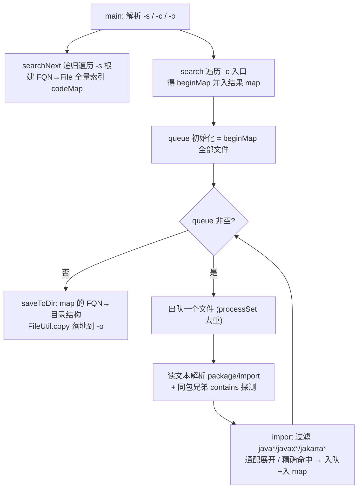

# i2f-tools-source-copier

> Java 源码「依赖闭包抽取」命令行工具壳（`i2f-tools` 组装档模块，**单类 `main` 分发件、零自研算法库依赖**）：以一个 `JavaSourceCodeCopier` 类实现「给定搜索根 `-s`（用于建立全量 `FQN→File` 索引）+ 起始文件/目录 `-c`（要抽取的入口）+ 输出目录 `-o`」三参数命令行，从入口出发做 **BFS 传递依赖闭包**——逐文件解析 `package`/`import` 头、把命中的 import 及同包内被文本引用的兄弟 `.java` 拉入队列，最终把所有可达源码按 `包名→目录` 结构复制落地，实现「从大仓里精准摘出一坨带依赖的最小可编译源码子集」。是 `i2f-tools` 组中 **唯一仍参与 Maven reactor 默认构建**（其余壳模块均被注释摘出）的自包含 fat jar 发布件。

## 模块路径

- `i2f-tools/i2f-tools-source-copier`

## 模块依赖

> 本模块 pom 极简：继承父 `i2f-tools`，仅声明 **1 个内部依赖** `i2f-io-file`（不带版本，由根 pom `dependencyManagement` 统管），并复用父 `pluginManagement` 里继承下来的 `maven-assembly-plugin`（`jar-with-dependencies`、`appendAssemblyId=false`、`Main-Class=${main.class}`）打自包含 fat jar。与 `face-recognizer`/`agent`/`encrypt` 那几个把自身从 `<modules>` 注释掉的壳不同，本模块在 `i2f-tools/pom.xml` 中 **未被注释**，是组内唯一随 reactor 默认构建的壳件。

| 依赖 | Maven 坐标 | scope | optional | 说明 |
| --- | --- | --- | --- | --- |
| i2f-io-file | `i2f.turbo:i2f-io-file` | compile | 否 | 唯一内部依赖，提供本工具全部 IO 能力：`FileUtil.copy(dstFile, srcFile)`（落盘复制）与 `FileUtil.loadTxtFile(file)`（UTF-8 读取源码文本），版本由根 DM 治理 |
| maven-assembly-plugin | `org.apache.maven.plugins:maven-assembly-plugin:3.1.0` | — | — | 非依赖而是构建插件；从父 pom `pluginManagement` 继承，`jar-with-dependencies` 描述符把 `i2f-io-file` 打入 fat jar，`Main-Class` 由本模块 `main.class` 属性覆盖为 `i2f.tools.soure.copier.JavaSourceCodeCopier` |

> 三方依赖：**无**。本模块运行时只需 JDK + `i2f-io-file`，故 fat jar 体积极小，与聚合 30 余三方库的 `i2f-tools-ops`、`i2f-tools-encrypt` 完全不是一个量级。

## 模块设计

模块只有 **一个类** `JavaSourceCodeCopier`（265 行，全 `static` 方法，无实例状态），按职责可拆为四段流水线：

- **命令行解析**（`main`）：一个 `char state` 状态机，遇 `-s`/`-c`/`-o` 切换模式，其后的每个参数分别归入 `searchPath`（建索引根）、`beginFile`（抽取入口）、`outputDir`（落地目录，默认 `./output/src`）。带引号参数经 `unescape` 去壳并还原 `\n\r\t\"\'\\`。`searchPath` 或 `beginFile` 任一为空则打印用法并返回。
- **全量索引构建**（`search`/`searchNext`）：递归遍历 `searchPath` 下所有 `.java`，把绝对路径归一为 `/`，截取最后一段 `/src/main/java/` 之后的部分作为 FQN（`.` 分隔）为 key、`File` 为 value，灌入 `codeMap`（`LinkedHashMap`，保插入序）。找不到 `/src/main/java/` 标记时降级用裸文件名。
- **依赖闭包 BFS**（`copy(Map, searchPath, beginFile)`）：先对 `beginFile` 同样 `search` 得 `beginMap` 直接并入结果 `map` 并入队；随后 `while(!queue.isEmpty())` 逐个出队（`processSet` 去重已处理），读文本后：
  - 扫描头部行提取 `packageName`（`package` 后 token，去尾分号）与 `importList`（`import` 后 token 集合），遇首个以 `public`/`class` 起始的行即停止头部扫描；
  - **同包隐式依赖**：列出该文件所在目录的兄弟 `.java`，若文件正文 `contains(简单类名)` 则把 `packageName.简单类名` 也当作 import 拉入（弥补同包无需 import 的引用）；
  - 对每个 import 跳过 `java.`/`javax.`/`jakarta.`；通配 `xxx.*` → 把索引中该前缀下「后缀不含点」的直接类型全部入队并入 `map`；精确 FQN → 命中索引则入队并入 `map`。
- **落盘**（`copy(File,...)`→`saveToDir`）：把结果 `map` 的每个 FQN key 点换成 `/` 加 `.java`，`FileUtil.copy(目标, 源)` 复制（内部会 `useParentDir` 自动建目录）。



## 模块目的

- 把「从大型多模块仓库里，只带走某个入口类及其全部（可解析范围内的）源码依赖」这一手工极易遗漏的操作，自动化为一次命令：不必关心传递依赖有几层、不必手动 `import` 反查，工具替你算闭包并原样按包结构落地，便于源码摘取、最小复现包构造、跨仓搬运类簇。
- 以「零业务依赖、单类、仅靠 `i2f-io-file`」的极简形态，演示一个可直接 `java -jar` 的自包含工具壳应有的最小 pom 结构。

## 模块功能

- **三参数命令行**：`-s` 搜索根（可多个，建全量索引）、`-c` 抽取入口（文件/目录，可多个）、`-o` 输出目录（缺省 `./output/src`）。
- **传递依赖闭包抽取**：从入口出发，沿 `import`（含 `.*` 通配展开）与同包隐式引用两层关系做 BFS，收集所有在索引中可解析到的 `.java`。
- **保结构落地**：按 FQN 还原目录树，输出到 `-o` 下，保持 `com/example/Foo.java` 式布局。
- **内置自检 `test()`**：硬编码以当前目录为搜索根、`.\i2f-jdk\i2f-bql\src\main\java` 为入口，抽到 `./copy/src`，用于开发期本地验证（不参与 `main` 流程）。

## 模块主要使用方法

```bash
# 打包（随 reactor 默认构建，也可单独）
mvn -pl i2f-tools/i2f-tools-source-copier -am package

# 从大仓中抽取某入口及其依赖闭包到 ./output/src
java -jar i2f-tools-source-copier.jar \
  -s ./java-src "C:/java/project/src" \
  -c ./java-src/reflect-util/src ./java-src/collection-util \
  -o ./output/src
```

注意事项：
- `searchPath`（`-s`）与 `beginFile`（`-c`）**都必填**，缺任一直接打印用法返回（`-o` 可省，默认 `./output/src`）。
- 依赖能否被抽取，取决于对应源码是否落在某个 `-s` 根下并能算出 FQN；不在索引里的 import（三方 jar、JDK、被跳过的 `java*/javax*/jakarta*`）自然不会被复制——本工具只搬「仓库里已有的 `.java` 源码」，不解析字节码依赖。
- 仅识别路径中含 `/src/main/java/` 的标准 Maven 布局来推导包名；其它布局会退化为裸类名，可能造成落地目录扁平化/重名覆盖。

## 模块特性总结

- **单类零状态**：全部 `public static` 方法，无并发无实例字段，行为完全由入参决定。
- **极简依赖面**：唯一实质依赖 `i2f-io-file`，fat jar 小巧；`unescape` 自带引号/转义处理，跨 cmd 传参友好。
- **保序输出**：索引用 `LinkedHashMap`、集合用 `LinkedHashSet`/`LinkedList`，结果顺序稳定可复现。
- **同包隐式补链**：不止 `import`，还用「正文 `contains(简单类名)`」捕获同包无需 import 的引用，闭包更完整。
- **组内唯一在 reactor 内**：与 face-recognizer/agent/encrypt 被注释摘出不同，本件默认随 `i2f-tools` 一起构建。

## 模块瑕疵或错误

> 以下为静态代码审查识别的潜在问题与隐患，未做运行实证。

- **包名拼写错误 `soure`（应为 `source`）**：包 `i2f.tools.soure.copier` 与 pom `main.class` 属性一致地写错，虽不影响运行，但属长期遗留的命名瑕疵，后续纠正需同时改动目录与属性且会破坏既有产物标识。
- **import 解析对 `import static` 处理错误**：头部扫描 `line.startsWith("import")` 后按空白切 token 取 `arr[1]`，对 `import static a.b.C;` 会把 `"static"` 当成导入名，既匹配不到索引也不报错，静默丢失静态导入依赖。
- **同包探测 `str.contains(simpleName)` 是裸子串匹配、易过度引入**：短名/高频词（如 `Util`、`Test`、`File`、`Config`）只要在正文任意处（含注释、字符串、其它类名子串）出现即被判为引用，导致闭包大量假阳性、抽出无关文件。
- **仅按头部首次遇 `public`/`class` 行即 break**：若类声明前有 javadoc/注解/以 `public`、`class` 起头的注释行，或 `package`/`import` 出现在更早的注释里，包名/import 提取可能被提前截断或误读，属脆弱的行文本解析。
- **索引 key 冲突静默覆盖**：多模块存在相同 FQN（如同包同名类）时 `codeMap.put` 后者覆盖前者，抽取结果只保留一路，无告警。
- **非标准布局降级为裸类名 → 落地扁平/覆盖**：无 `/src/main/java/` 标记的文件 key 退化为文件名，`saveToDir` 直接落 `-o/<类名>.java`，不同包同名类互相覆盖。
- **`test()` 硬编码 Windows 相对路径且随主源集发布**：`.\\i2f-jdk\\i2f-bql\\...`、`./copy/src` 写死，仅作开发期自测，混在 `main/java` 生产源集内，不参与 `main` 却随 jar 携带。
- **状态机的参数值可与开关字面碰撞**：解析时先判 `item.equals("-s"/"-c"/"-o")` 再入桶，若某真实路径恰为这些字符串会被误当开关切换状态（边界，概率极低）。
- **无结果反馈**：`copy`/`saveToDir` 不打印抽取了多少文件、跳过了哪些未命中 import，抽取「少了文件」时难以排查，可观测性偏弱。
- **只搬 `.java` 源码不含资源**：对入口依赖的 `resources`、非 `src/main/java` 源码根（如 `src/test/java`、其他语言）一概不处理，抽取子集未必真正自洽可编译——定位是「源码抽取器」而非「可编译最小工程生成器」，使用时需知悉边界。
