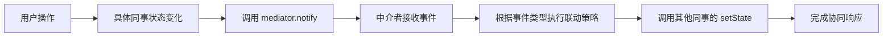

# 中介者模式（Mediator Pattern）

> 用一个中介对象来封装一系列的对象交互，使各对象不需要显式地相互引用，从而使其耦合松散。
> **分类：行为型模式（Behavioral Pattern）**

---

## 一、核心逻辑

### 1.1 本质思想

中介者模式的核心是**将网状依赖转化为星形依赖**。当多个对象之间存在复杂的多对多交互关系时，如果让它们直接相互引用和通信，会形成高度耦合的网状结构（N×(N-1) 条依赖关系）。中介者模式引入一个"中介者"对象作为通信枢纽，所有对象只与中介者交互，依赖关系降为 N 条。

### 1.2 核心机制

- **集中式协调**：所有复杂的协作逻辑都集中在中介者中管理，同事对象（Colleague）只需关注自身职责，通过中介者间接通信。
- **事件驱动联动**：同事对象状态变化时，调用 `mediator.notify(this, event)` 通知中介者，中介者根据事件类型决定如何协调其他同事对象。
- **迪米特法则（Law of Demeter）**：每个对象应当对其他对象有最少了解。同事对象只认识中介者，不认识其他同事，完美遵循此法则。
- **与观察者模式的区别**：
  - 观察者模式是**一对多**的依赖关系，主题通知所有观察者，观察者之间无交互。
  - 中介者模式是**多对多**的复杂交互，中介者协调所有参与者，参与者之间通过中介者间接交互。

### 1.3 依赖关系对比

```
没有中介者（网状依赖 —— 耦合度高）    使用中介者（星形依赖 —— 耦合度低）
─────────────────────────────────   ─────────────────────────────────
A ←→ B ←→ C                         A → Mediator ← B
↑    ↓    ↑                              ↓
D ←→ E ←→ F                         C → Mediator ← D
                                         ↓
                                    E → Mediator ← F

依赖关系数量：N×(N-1) 条            依赖关系数量：N 条（降低显著）
```

---

## 二、核心组成

中介者模式包含 **4 大核心角色**，在本实现中的映射如下：

### 2.1 抽象中介者（Abstract Mediator）

**对应类**：[Mediator.java](./mediator/Mediator.java)

- **职责**：定义中介者接口，声明用于与同事对象通信的方法。
- **核心方法**：`abstract void notify(Component sender, String event)` —— 接收同事对象的通知并进行协调。
- **设计意图**：以"智能楼宇控制系统"为场景，楼宇控制器作为中介者协调灯光、空调、窗帘、安防等子系统。

### 2.2 具体中介者（Concrete Mediator）

**对应类**：[SmartBuildingController.java](./mediator/impl/SmartBuildingController.java)

- **职责**：实现抽象中介者接口，持有所有同事对象的引用，封装复杂的协作逻辑。
- **核心方法**：
  - `registerComponents(...)` —— 注册所有同事对象并注入中介者引用。
  - `notify(sender, event)` —— 根据事件类型执行联动策略（集中管理所有协作规则）。
- **协作规则示例**：

| 事件 | 中介者协调动作 |
| --- | --- |
| 灯光开启（LIGHT_ON） | → 自动关闭窗帘（避免眩光） |
| 空调开启（AC_ON） | → 自动关闭窗帘（保温节能） |
| 窗帘关闭（CURTAIN_CLOSED） | → 自动开启灯光（补充照明） |
| 安防启动（SECURITY_ARMED） | → 关闭窗帘 + 开启外围灯光 |
| 报警触发（ALARM_TRIGGERED） | → 开启所有灯光 + 关闭窗帘 + 调节空调（威慑+保护隐私） |

### 2.3 抽象同事（Abstract Colleague）

**对应类**：[Component.java](./component/Component.java)

- **职责**：定义所有同事对象的公共接口，包含对中介者的引用。
- **核心字段**：`protected Mediator mediator` —— 每个同事对象持有中介者的引用，通过中介者与其他同事通信。
- **核心方法**：`setMediator(Mediator)`、`getName()`。
- **设计亮点**：同事对象之间互不持有对方的引用，只认识中介者。

### 2.4 具体同事（Concrete Colleague）

**对应类**：
- [Light.java](./component/impl/Light.java) —— 灯光系统
- [AirConditioner.java](./component/impl/AirConditioner.java) —— 空调系统
- [Curtain.java](./component/impl/Curtain.java) —— 窗帘系统
- [SecuritySystem.java](./component/impl/SecuritySystem.java) —— 安防系统

- **职责**：实现具体业务逻辑，状态变化时通过 `mediator.notify(this, event)` 通知中介者。
- **设计亮点**：
  - 每个同事对象只关注自身职责（如灯光只管开关、空调只管温控）。
  - 当需要与其他设备协作时，完全由中介者负责协调。
  - 提供 `setState(...)` 方法供中介者直接控制（响应联动指令）。

---

## 三、案例设计解析

### 3.1 业务场景

**智能楼宇自动化控制系统**：一栋智能办公楼包含多个子系统（灯光、空调、窗帘、安防），这些系统需要根据环境变化和用户操作进行联动。例如：
- 用户开灯时，自动关闭窗帘避免眩光。
- 空调启动时，自动关闭窗帘保温节能。
- 安防报警时，联动开启所有灯光威慑入侵者、关闭窗帘保护隐私。

### 3.2 模式使用流程



**完整执行链路（以"用户开启灯光"为例）**：

1. **用户触发**：调用 `light.turnOn()`
2. **状态变化**：`Light` 对象设置 `isOn = true`，打印 "灯光已开启"
3. **通知中介者**：调用 `mediator.notify(this, "LIGHT_ON")`
4. **中介者协调**：`SmartBuildingController.notify()` 接收到事件
   - 匹配到 `LIGHT_ON` 分支
   - 执行联动策略：调用 `curtain.close()`
5. **窗帘响应**：`Curtain` 对象设置 `isClosed = true`，打印 "窗帘已关闭"
6. **二次通知**：窗帘调用 `mediator.notify(this, "CURTAIN_CLOSED")`
7. **中介者再次协调**：匹配到 `CURTAIN_CLOSED` 分支，调用 `light.turnOn()`（但此时灯光已开启，不会重复触发）
8. **联动完成**：系统达到稳定状态

### 3.3 测试用例设计

[Test.java](./Test.java) 演示了 **4 个典型场景**：

#### 场景一：用户开启灯光 → 自动关闭窗帘避免眩光

```java
light.turnOn();
// 输出：
//   💡 [灯光系统] 灯光已开启
//   📡 [楼宇控制器] 收到通知：灯光系统 -> LIGHT_ON
//   📡 [楼宇控制器] 联动策略：灯光开启，自动关闭窗帘避免眩光
//   🪟 [窗帘系统] 窗帘已关闭（遮光）
```

#### 场景二：用户开启空调 → 自动关闭窗帘保温节能

```java
airConditioner.turnOn();
// 输出：
//   ❄️ [空调系统] 空调已开启，设定温度：25.0°C
//   📡 [楼宇控制器] 收到通知：空调系统 -> AC_ON
//   📡 [楼宇控制器] 联动策略：空调开启，自动关闭窗帘保温节能
//   🪟 [窗帘系统] 窗帘已关闭（遮光）
```

#### 场景三：安防系统启动 → 关闭窗帘 + 开启外围灯光

```java
securitySystem.arm();
// 输出：
//   🚨 [安防系统] 警戒模式已启动
//   📡 [楼宇控制器] 收到通知：安防系统 -> SECURITY_ARMED
//   📡 [楼宇控制器] 联动策略：安防启动，关闭窗帘并开启外围灯光
//   🪟 [窗帘系统] 窗帘已关闭（遮光）
//   💡 [灯光系统] 灯光已开启
```

#### 场景四：报警触发 → 全系统联动响应

```java
securitySystem.triggerAlarm();
// 输出：
//   🚨 [安防系统] ⚠️ 报警触发！检测到异常情况！
//   📡 [楼宇控制器] 收到通知：安防系统 -> ALARM_TRIGGERED
//   📡 [楼宇控制器] 联动策略：报警触发，开启所有灯光威慑入侵者，关闭窗帘保护隐私
//   💡 [灯光系统] 灯光已开启
//   🪟 [窗帘系统] 窗帘已关闭（遮光）
//   ❄️ [空调系统] 被中介者控制 -> 开启，温度：22.0°C
```

### 3.4 解耦验证

测试代码通过反射验证了同事对象之间的独立性：

```java
System.out.println("Light 类中是否引用 AirConditioner？ " + hasField(Light.class, "airConditioner"));
System.out.println("Light 类中是否引用 Curtain？ " + hasField(Light.class, "curtain"));
System.out.println("Light 类中是否引用 SecuritySystem？ " + hasField(Light.class, "securitySystem"));
// 输出：全部为 false，证明各同事对象仅持有 Mediator 引用，彼此互不依赖
```

### 3.5 设计优势总结

1. **降低耦合度**：将网状依赖转化为星形依赖，遵循迪米特法则（依赖关系从 12 条降至 4 条，降低 67%）。
2. **集中控制**：复杂协作逻辑集中在中介者中，便于维护和修改（新增联动规则只需修改中介者）。
3. **简化对象协议**：同事对象只需与中介者通信，无需了解其他对象的接口和状态。
4. **提高复用性**：同事对象可独立于其他对象复用（如灯光系统可单独用于其他项目）。
5. **符合单一职责**：协作逻辑从各组件中剥离，由中介者统一管理（组件只关注自身业务，中介者只关注协调）。

---

## 四、典型应用场景

中介者模式适用于以下场景：

### 4.1 GUI 组件联动

**场景描述**：桌面应用或 Web 表单中，多个 UI 组件需要联动（如按钮启用状态依赖于文本框输入、下拉框选择影响其他组件可见性）。

**应用方式**：
- 中介者：表单控制器（FormController）
- 同事对象：按钮、文本框、下拉框、复选框等 UI 组件
- **典型案例**：Java Swing 中的对话框管理、前端框架的表单验证联动。

### 4.2 工作流引擎 / 任务调度系统

**场景描述**：复杂业务流程中，多个任务节点需要按条件流转，节点之间存在复杂的依赖和触发关系。

**应用方式**：
- 中介者：工作流引擎（WorkflowEngine）
- 同事对象：各个任务节点（TaskNode）
- **典型案例**：Activiti、Flowable 工作流引擎；XXL-Job 任务编排；Spring Batch 的 Step 流转。

### 4.3 消息中间件 / 事件总线

**场景描述**：多个服务或模块需要异步通信，直接耦合会导致系统难以扩展和维护。

**应用方式**：
- 中介者：消息代理（Message Broker）/ 事件总线（EventBus）
- 同事对象：消息生产者、消息消费者
- **典型案例**：Spring `ApplicationEventPublisher`（解耦事件发布者与订阅者）；RabbitMQ、Kafka 消息中间件；Spring Integration 的 `MessageChannel`。

### 4.4 智能设备协同（IoT）

**场景描述**：智能家居、智能楼宇、工业自动化中，多个设备需要根据环境传感器数据进行联动。

**应用方式**：
- 中介者：智能网关 / 控制中心（SmartHub）
- 同事对象：灯光、空调、窗帘、安防、温湿度传感器等
- **典型案例**：本案例的智能楼宇控制系统；HomeAssistant 智能家居平台。

### 4.5 空中交通管制系统（ATC）

**场景描述**：多架飞机在空中飞行时，不能直接相互通信，必须通过空中交通管制中心协调航线、高度、降落顺序。

**应用方式**：
- 中介者：塔台控制中心（ControlTower）
- 同事对象：各架飞机（Airplane）
- **经典教材案例**：GoF 原著中的标准示例，完美体现中介者模式的核心价值。

### 4.6 聊天室 / 多人协作系统

**场景描述**：多人聊天室中，用户之间不直接通信，所有消息通过服务器转发。

**应用方式**：
- 中介者：聊天室服务器（ChatRoom）
- 同事对象：各个用户（User）
- **典型案例**：WebSocket 聊天室、协同编辑系统（如 Google Docs）、在线会议系统。

### 4.7 Spring 框架中的应用

**场景描述**：Spring 框架本身大量使用中介者模式思想，`ApplicationContext` 作为 Bean 之间的中介者。

**应用方式**：
- 中介者：`ApplicationContext`（IoC 容器）
- 同事对象：各个 Spring Bean
- **典型案例**：
  - Bean 之间的依赖注入通过容器协调，Bean 不直接创建依赖对象。
  - `ApplicationEventPublisher` 解耦事件发布者与订阅者（观察者 + 中介者结合）。
  - Spring Cloud `LoadBalancer` 作为调用方与服务实例之间的中介。

### 4.8 编译器 AST 遍历与转换

**场景描述**：编译器对抽象语法树（AST）进行多阶段处理（词法分析、语法分析、语义分析、代码生成），各阶段需要协调。

**应用方式**：
- 中介者：编译器主控程序（CompilerDriver）
- 同事对象：词法分析器、语法分析器、语义分析器、代码生成器
- **典型案例**：JavaC 编译器、ANTLR 解析器框架。

---

## 五、模式优缺点

### 5.1 优点

✅ **降低耦合度**：将多对多的网状依赖转化为一对多的星形依赖，遵循迪米特法则。  
✅ **集中控制**：复杂协作逻辑集中在中介者中，便于理解、维护和修改。  
✅ **简化对象协议**：同事对象只需与中介者通信，无需了解其他对象的接口。  
✅ **提高复用性**：同事对象可独立于其他对象复用。  
✅ **符合单一职责原则**：协作逻辑从各组件中剥离，由中介者统一管理。  

### 5.2 缺点

❌ **中介者可能过于复杂**：当协作逻辑非常复杂时，中介者可能变成"上帝对象"（God Object），难以维护。  
❌ **集中式瓶颈**：所有通信都经过中介者，可能成为性能瓶颈或单点故障。  
❌ **难以扩展**：新增同事对象可能需要修改中介者的协调逻辑（违反开闭原则）。  

### 5.3 使用建议

- 当系统中对象之间的交互**复杂且混乱**时，优先考虑中介者模式。
- 如果协作逻辑过于复杂，可以考虑**拆分中介者**（按功能域划分多个中介者）。
- 中介者模式常与**观察者模式、命令模式**结合使用，实现更灵活的事件驱动架构。

---

## 六、与相关模式的关系

| 模式 | 关系说明 |
| --- | --- |
| **观察者模式** | 观察者是一对多的依赖关系，观察者之间无交互；中介者是多对多的复杂交互，参与者通过中介者间接交互。两者可结合使用（中介者作为观察者管理多个同事）。 |
| **命令模式** | 命令模式封装请求为对象，中介者可使用命令对象来协调同事对象的操作，实现可撤销、可排队的协作。 |
| **外观模式** | 外观模式为子系统提供统一接口，目的是简化使用；中介者模式封装对象之间的交互，目的是解耦。外观是单向的，中介者是双向的。 |
| **单例模式** | 中介者通常以单例形式存在（如 Spring ApplicationContext），确保全局只有一个协调中心。 |

---

> **总结**：中介者模式通过引入"通信枢纽"，将复杂的网状依赖转化为简单的星形依赖，是处理多对象协作问题的利器。但需注意避免中介者过度膨胀，合理拆分职责以保持系统的可维护性。
