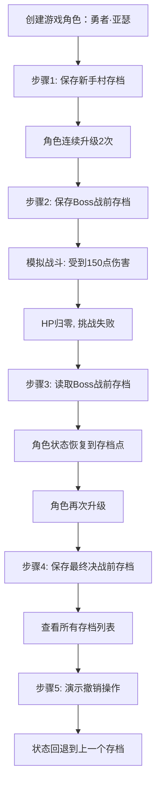

# 备忘录模式（Memento Pattern）

> **定义**：在不破坏封装性的前提下，捕获一个对象的内部状态，并在该对象之外保存这个状态，以便以后将该对象恢复到原先保存的状态。
> 
> **分类**：行为型模式（Behavioral Pattern）

---

## 一、核心逻辑

备忘录模式的核心在于**状态快照的保存与恢复**，同时严格维护**封装性原则**。其本质逻辑包括：

### 1.1 封装性保护

- **问题**：对象需要保存内部状态，但直接暴露状态会破坏封装性。
- **解决**：通过 `Memento` 对象将状态封装起来，外部（Caretaker）只能保存和传递备忘录，无法访问或修改其内部数据。
- **实现**：本实现中 `Memento` 的字段使用 `final` 修饰，确保状态快照一旦创建就不可变；只有通过 `Originator` 才能读取和应用备忘录内容。

### 1.2 状态快照机制

- **保存**：`Originator` 在特定时刻调用 `createMemento()` 将当前所有关键状态打包到 `Memento` 对象中。
- **恢复**：`Originator` 调用 `restoreMemento(Memento)` 从备忘录中读取状态并应用到自身。
- **管理**：`Caretaker` 负责存储多个备忘录（支持多存档位），并提供索引访问、撤销等操作。

### 1.3 职责分离

| 角色 | 职责 | 是否知晓状态细节 |
|------|------|------------------|
| Originator（发起人） | 创建备忘录、恢复状态 | ✅ 是 |
| Memento（备忘录） | 存储状态快照 | ✅ 是（但对外隐藏） |
| Caretaker（管理者） | 保存和管理备忘录 | ❌ 否 |

---

## 二、核心组成

### 2.1 模式角色与类映射

```
备忘录模式结构
├── Originator（发起人）—— GameRole.java
│   ├── 核心方法：
│   │   ├── createMemento(): Memento        ← 创建备忘录，保存当前状态
│   │   └── restoreMemento(Memento): void   ← 从备忘录恢复状态
│   └── 业务方法：
│       ├── levelUp(): void                 ← 模拟角色升级
│       └── takeDamage(int): void           ← 模拟战斗扣血
│
├── Memento（备忘录）—— Memento.java
│   ├── 状态字段（final 不可变）：
│   │   ├── level: int                      ← 角色等级
│   │   ├── hp: int                         ← 生命值
│   │   ├── mp: int                         ← 魔法值
│   │   ├── attack: int                     ← 攻击力
│   │   └── defense: int                    ← 防御力
│   └── 特性：状态快照一旦创建不可修改
│
└── Caretaker（管理者）—— SaveManager.java
    ├── 存储结构：
    │   ├── saveNames: List<String>         ← 存档名称列表
    │   ├── mementos: List<Memento>         ← 备忘录列表
    │   └── currentIndex: int               ← 当前存档索引
    └── 核心方法：
        ├── addMemento(String, Memento)     ← 保存新存档
        ├── getMemento(int): Memento        ← 读取指定存档
        ├── getLatestMemento(): Memento     ← 读取最新存档
        └── undo(): Memento                 ← 撤销到上一个存档
```

### 2.2 关键设计决策

#### 2.2.1 不可变性设计

```java
// Memento.java 使用 final 字段确保状态快照不可变
private final int level;
private final int hp;
private final int mp;
private final int attack;
private final int defense;
```

**意义**：防止外部代码篡改存档内容，确保状态恢复的可靠性。

#### 2.2.2 多存档位支持

```java
// SaveManager.java 支持保存多个备忘录
private final List<Memento> mementos;
private final List<String> saveNames;

public void addMemento(String saveName, Memento memento) {
    saveNames.add(saveName);
    mementos.add(memento);
    currentIndex = mementos.size() - 1;
}
```

**意义**：模拟游戏的多个存档槽位，允许在不同关键时刻保存状态。

#### 2.2.3 撤销操作实现

```java
// SaveManager.java 撤销到上一个存档
public Memento undo() {
    if (currentIndex > 0) {
        currentIndex--;
        return mementos.get(currentIndex);
    }
    return null;
}
```

**意义**：提供类似 Ctrl+Z 的撤销功能，无需手动指定存档索引。

---

## 三、案例设计解析

### 3.1 业务场景

**游戏角色存档/读档系统**：玩家在游戏过程中可以在关键时刻（如新手村完成、Boss 战前）保存角色状态（等级、生命值、魔法值、攻击力、防御力），如果后续操作不满意（如挑战 Boss 失败），可以读取存档恢复到之前的状态。

### 3.2 案例执行流程



### 3.3 模式使用详解

#### 3.3.1 状态保存（存档）

```java
// 1. Originator 创建备忘录
Memento save1 = hero.createMemento();

// 2. Caretaker 保存备忘录（不关心内容）
saveManager.addMemento("新手村", save1);
```

**关键点**：`SaveManager` 只知道保存了一个 `Memento` 对象，但无法访问其中的等级、HP 等具体数据。

#### 3.3.2 状态恢复（读档）

```java
// 1. Caretaker 提供备忘录
Memento restoreSave = saveManager.getMemento(1);

// 2. Originator 读取并应用备忘录
hero.restoreMemento(restoreSave);
```

**关键点**：只有 `GameRole` 能解析 `Memento` 中的数据并恢复到自身属性。

#### 3.3.3 撤销操作

```java
// 执行撤销（类似 Ctrl+Z）
Memento undoSave = saveManager.undo();
if (undoSave != null) {
    hero.restoreMemento(undoSave);
}
```

**关键点**：`undo()` 自动将索引前移，返回上一个备忘录，简化了客户端调用。

### 3.4 封装性验证

```java
// 外部代码从 SaveManager 获取备忘录
Memento testMemento = saveManager.getLatestMemento();

// 只能通过 toString() 查看描述，无法修改内部状态
System.out.println(testMemento);
// 输出：存档 [等级: 3 | HP: 200 | MP: 110 | 攻击: 40 | 防御: 20]

// ❌ 以下操作无法实现（Memento 没有 setter 方法）
// testMemento.setHp(999);  // 编译错误
```

**验证结果**：Caretaker 和外部代码都无法篡改备忘录内容，封装性得到严格保护。

---

## 四、典型应用场景

### 4.1 文本编辑器撤销功能

**场景**：Word、VS Code 等编辑器的 Ctrl+Z（撤销）和 Ctrl+Y（重做）功能。

**应用方式**：
- `Originator`：文档对象（Document）
- `Memento`：文档内容快照（文本内容、光标位置、格式设置）
- `Caretaker`：撤销管理器（UndoManager）维护历史记录栈

**实现逻辑**：每次编辑操作前保存文档状态到备忘录，用户撤销时从栈中弹出上一个备忘录并恢复。

### 4.2 数据库事务回滚

**场景**：数据库事务执行失败时，通过 undo log 回滚到事务开始前的状态。

**应用方式**：
- `Originator`：数据库记录/表状态
- `Memento`：undo log（记录修改前的数据快照）
- `Caretaker`：事务管理器（Transaction Manager）

**实现逻辑**：事务开始时创建检查点（备忘录），每次修改前记录旧值到 undo log，事务回滚时按相反顺序应用 undo log 恢复数据。

### 4.3 浏览器前进/后退功能

**场景**：浏览器的后退（Back）和前进（Forward）按钮导航历史记录。

**应用方式**：
- `Originator`：浏览器页面状态（URL、DOM 树、表单数据、滚动位置）
- `Memento`：页面状态快照
- `Caretaker`：浏览器历史记录管理器（维护 back-stack 和 forward-stack）

**实现逻辑**：访问新页面时保存当前状态到 back-stack，后退时从 back-stack 弹出并恢复到 forward-stack，前进时反向操作。

### 4.4 游戏存档系统

**场景**：RPG 游戏中的手动存档、自动存档、快速存档功能。

**应用方式**：
- `Originator`：游戏角色/游戏世界状态
- `Memento`：存档文件（角色属性、背包、任务进度、地图位置）
- `Caretaker`：存档管理器（支持多存档槽、云存档）

**实现逻辑**：玩家触发存档时序列化当前状态到文件，读档时反序列化并应用到游戏对象。

### 4.5 图形编辑软件历史记录

**场景**：Photoshop、Figma 等设计软件的历史记录面板，支持跳转到任意历史状态。

**应用方式**：
- `Originator`：画布/图层状态
- `Memento`：图层快照（像素数据、滤镜参数、变换矩阵）
- `Caretaker`：历史记录管理器（支持撤销/重做/跳转到指定步骤）

**实现逻辑**：每次操作前保存画布状态快照，用户可通过历史记录面板跳转到任意节点，或逐步撤销/重做。

### 4.6 表单数据草稿保存

**场景**：在线填写长表单时自动保存草稿，防止意外关闭导致数据丢失。

**应用方式**：
- `Originator`：表单数据模型
- `Memento`：草稿快照（表单字段值、验证状态）
- `Caretaker`：草稿管理器（本地存储/云端存储）

**实现逻辑**：定时或用户操作时保存表单状态到 localStorage 或服务器，重新打开时恢复草稿状态。

### 4.7 虚拟机快照

**场景**：VMware、VirtualBox 等虚拟机软件的快照功能，保存虚拟机某一时刻的完整状态。

**应用方式**：
- `Originator`：虚拟机状态（内存、磁盘、CPU 寄存器、设备状态）
- `Memento`：快照文件（磁盘差异文件 + 内存转储）
- `Caretaker`：快照管理器（支持多快照、快照树）

**实现逻辑**：创建快照时记录当前磁盘状态和内存镜像，恢复快照时回滚磁盘差异并加载内存转储。

---

## 五、模式优势与注意事项

### 5.1 核心优势

| 优势 | 说明 |
|------|------|
| **封装性保护** | Originator 的内部状态不会暴露给外部对象 |
| **简化 Originator** | 不需要自己维护状态历史，交由 Caretaker 管理 |
| **支持撤销/重做** | 通过保存多个备忘录实现历史回溯 |
| **状态快照不可变** | Memento 使用 final 字段，确保存档不被篡改 |
| **职责分离** | Originator 专注业务逻辑，Caretaker 专注状态管理 |

### 5.2 注意事项

⚠️ **内存开销**：频繁保存大对象的状态快照可能导致内存占用过高，需要权衡保存频率和快照粒度。

⚠️ **深拷贝问题**：如果状态包含引用类型，需要确保创建深拷贝而非浅拷贝，否则外部修改可能影响备忘录内容。

⚠️ **窄接口设计**：在实际应用中，可通过内部类或包级访问控制进一步限制 Memento 的可见性，确保只有 Originator 能访问其内容。

---

## 六、与其他模式的关系

| 模式 | 关系 | 说明 |
|------|------|------|
| **命令模式** | 协同使用 | 命令模式可将备忘录作为命令的一部分，支持命令的撤销操作 |
| **原型模式** | 替代方案 | 原型模式通过克隆创建对象，可作为备忘录的简化实现 |
| **迭代器模式** | 结合使用 | 迭代器可遍历 Caretaker 管理的备忘录集合 |

---

> **总结**：备忘录模式是實現撤销/重做、状态快照、事务回滚等功能的核心设计模式。通过 Originator、Memento、Caretaker 三个角色的协作，在不破坏封装性的前提下实现了状态的保存与恢复。本案例以游戏存档为场景，清晰展示了模式的核心机制和封装性保护。
